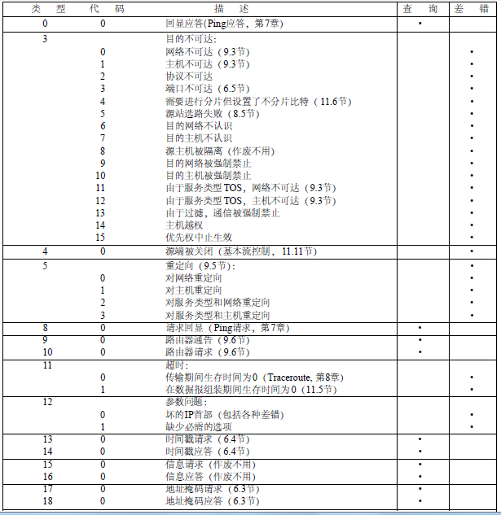
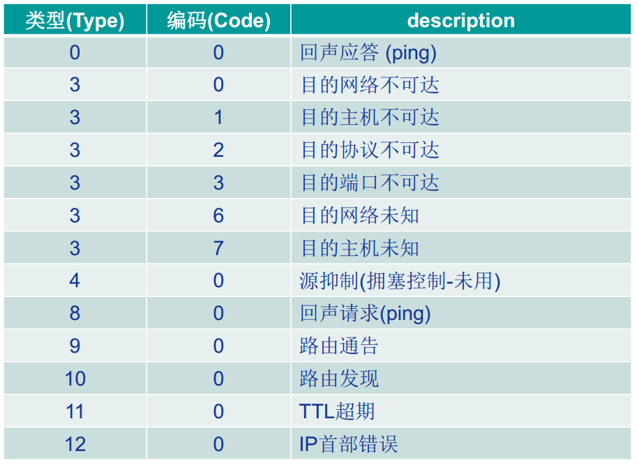

# ICMP

## ICMP协议格式

`ICMP`报文是在IP数据报内部传输的：`| IP头部 | ICMP报文 |`

## `ICMP`报文格式

```
  Bits    0–7     8–15    16–23   24–31
  0       Type     Code        Checksum
  32      Rest of Header
```

- `Type` – ICMP type as specified below.
- `Code` – Subtype to the given type.
- `Checksum` – Error checking data. Calculated from the ICMP header+data, with value 0 for this field. The checksum algorithm is specified in [RFC 1071](https://tools.ietf.org/html/rfc1071).
- `Rest of Header` – Four byte field. Will vary based on the ICMP type and code.

`ICMP`报文可以分为两类：查询报文和差错报文，具体报文类型如下图所示：




下面各种情况都不会导致产生`ICMP`差错报文：

1) `ICMP`差错报文（但是，`ICMP`查询报文可能会产生`ICMP`差错报文）。
2) 目的地址是广播地址或多播地址的`IP`数据报。
3) 作为链路层广播的数据报。
4) 不是`IP`分片的第一片。
5) 源地址为零地址、环回地址、广播地址或多播地址。


这些规则是为了防止过去允许`ICMP`差错报文对广播分组响应所带来的广播风暴。

## ICMP地址掩码请求

`ICMP`地址掩码请求用于无盘系统启动时获取自己的子网掩码。

构造一个`ICMP Address Mask Request`：

```sh
#We want to send an ICMP packet Address Mask Request and wait 10 seconds to see the replies. We mask the packet with source address of 10.2.3.4 and we send it to the address 10.0.1.255:
icmpush -mask -sp 10.2.3.4 -to 10 10.0.1.255
```

注意：`ICMP`地址掩码应答必须是收到请求接口的子网掩码

## ICMP时间戳请求与应答

`ICMP`时间戳请求允许系统向另一个系统查询当前的时间，返回的建议值是自午夜开始计算的毫秒数，协调的统一时间，可以达到毫秒的分辨率。


构造一个ICMP时间戳请求： `icmpush -tstamp  192.168.3.255`

## ICMP端口不可达差错

根据`code`的不同，共有15种类型的`ICMP`差错报文。



注意，`ICMP`报文是在主机之间交换的，而不用目的端口号，而`UDP`数据报则是从一个特定端口发送到另一个特定端口。

`ICMP`的一个规则是， `ICMP`差错报文必须包括生成该差错报文的数据报`IP`首部（包含任何选项），还必须至少包括跟在该`IP`首部后面的前8个字节。导致差错的数据报中的`IP`首部要被送回的原因是因为`IP`首部中包含了协议字段，使得`ICMP`可以知道如何解释后面的8个字节。对于`TCP`和`UDP`协议来说，这8个字节正好是源端口号和目的端口号。

## ping

`ping`通过`ICMP`回显请求和应答实现。

```sh
# setup ping interval in seconds
ping -i 5 IP

# Check whether the local network interface is up and running
ping 0

# Set packet num
ping -c 5 google.com

# Set packet size
ping -s 100 localhost
```

## traceroute

`ping`程序提供一个记录路由选项，但并不是所有的路由机都支持这个选项，而且IP首部选项字段最多也只能存储9个`IP`地址，因此开发`traceroute`是必要的。
`traceroute`利用了`ICMP`报文和`IP`首部的`TTL`字段。`TTL`是一个`8bit`的字段，为路由器的跳站计数器，也表示数据报的生存周期。每个处理数据报的路由器都需要将`TTL`减一。如果`TTL`为0或者1，则路由器不转发该数据报，如果`TTL`为1，路由器丢弃该包并给源地址发送一个`ICMP`超时报文（如果是主机接收到`TTL`为1的数据报可以交给上层应用程序）。

`traceroute`程序开始时发送一个`TTL`字段为1的`UDP`数据报（选择一个不可能的值作为`UDP`端口号），然后将`TTL`每次加1，以确定路径中每个路由器。每个路由器在丢弃`UDP`数据报的时候都返回一个`ICMP`超时报文（如：`ICMP time exceeded in-transit`, length 36），而最终主机则产生一个`ICMP`端口不可达报文（如： `ICMP 74.125.128.103 udp port 33492 unreachable`, length ）。

对每个`TTL`，发送3份数据报，并且计算打印出往返时间。如果5秒内未收到任意一份回应，则打印一个星号。

需要注意的是：

1. 并不能保证现在的路由就是将来所采用的路由；
2. 不能保证`ICMP`报文的路由与`traceroute`程序发出的`UD`P数据报采用同一路由；
3. 返回的`ICMP`报文中信源的`IP`地址是`UDP`数据报到达的路由器接口的`IP`地址。

## 参考

- [TCP/IP协议详解卷一 -- ICMP：Internet控制报文协议](https://www.kancloud.cn/lifei6671/tcp-ip/140197)
- [Traceroute](https://zh.wikipedia.org/wiki/Traceroute)
