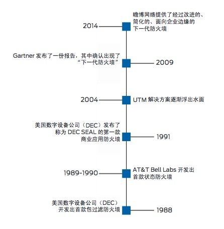
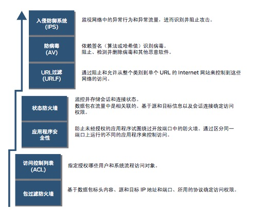

# 防火墙演进过程

防火墙现在可以为我们提供强大深厚的安全和高级功能，这是怎样的一个发展过程呢？这是一个很长的故事，但却发生在一段相对较短的时间内，很可能您也是这段故事的见证者。

二十世纪七十年代晚期 ，局域网(`LAN`) 和连接系统面世，因此公司能让员工彼此通信 ，也能通过网络传送数据 。

`LAN`实现了局间进行电子通信，也就是电子邮件。对公司而言，该网络是本地的、私有且专属的，它支持有限数量的用户。`LAN`的安全原则形式是密码保护。

到 了二十世纪八十年代初，推出了多协议路由器 ，用 于互连不同的网络并定向这些网络之间的流量。有了路由器和其他`Internet`技术后，全球电子发展动向尽在计算机用户的掌握之中。路由器用来定向通过`Internet`的流量，还包括访问控制软件来保护业务传输和数据访问。

但是路由器无法提供必需的安全性，因此无法应对`Internet`连接带来的挑战。全球通信为黑客提供了入侵连接企业和个人电脑的机会，他们很快就会进入私人帐户。为找到这些黑客而执行的探测任务，迎来了计算机相关科学（称为数字取证）的发展。越来越多的安全问题推动了计算机网络安全的发展，促使产生了第一个网络防火墙。这些防火墙基于策略允许或阻止流量。网络防火墙在用途上与物理防火墙相似，都是用来遏制攻击并防止它们蔓延。计算机网络防火墙在内部网络与外部网络之间竖起一道屏障，前者是在公司内部并被视为可信，后者被认为不可信，例如`Internet`

## 第一代防火墙：包过滤防火墙

第一代防火墙是相对简单的过滤系统，被称为包过滤防火墙，但发展到今天，它们已成为高度复杂的计算机网络安全技术。

包过滤防火墙也称为**无状态防火墙**，基于过滤规则过滤出和丢弃流量。包过滤防火墙不保持连接状态。也就是说，**将一个数据包作为一个原子单元处理，而不涉及相关的数据包**。包过滤防火墙通常部署在路由器和交换机上。

包过滤的核心在于ACL的定义。而ACL的核心其实就是一个典型的五元组。通常在第3层和第4层执行数据包处理，方法就是对照**五元组**匹配数据包的标头字段：

- 源IP地址
- 目的IP地址
- 源端口
- 目的端口
- 协议号

不会将更高层的信息考虑在内。

包过滤防火墙的主要弱点是，黑客可以利用缺乏状态这一缺陷精心设计数据包以通过过滤。第一次使用包过滤防火墙时，操作系统堆栈易受攻击，单个数据包可能会导致系统崩溃，但在今天很少发生这种情况。

包过滤防火墙允许所有基于`Web`的流量通过防火墙，包括基于 `Web`的攻击。这些防火墙无法区分有效的返回数据包和冒名顶替返回的数据包。如何处理这些及其他的类似问题，为防火墙的未来发展创造了条件。

> (1988) 美国数字设备公司（DEC）开发出了首款无状态包过滤防火墙

## 第二代防火墙：状态防火墙

包过滤防火墙出现后不久就出现了状态防火墙。第二代防火墙具有与包过滤防火墙相同的功能，但它们可以监控和存储会话、连接状态。第二代防火墙基于源和目标IP地址、源和目标端口以及所用的协议将流量中的相关数据包关联起来。如果有数据包**双向匹配**这些信息，那么它就属于该流量。

随着`Internet`的广泛使用，企业逐渐高度网络化，他们可以有选择地为用户提供`Internet`服务，但前提是他们能够保护自己的资产免受从 `LAN`外部发起的入侵和攻击。企业还想防止员工和其他企业人员（例如承包商及合作伙伴）尝试进入他们的网络，试图访问未经授权的网络资源。此外，他们还想保护自己的网络免受从`LAN`内部和整个`Internet`中发起的攻击，不管是有意还是无心为之，都要阻止。为了解决这些问题，企业转向部署状态防火墙。

无状态包过滤防火墙没有给管理员提供会话内和会话间的通信和连接状态所需的工具。状态防火墙解决了这个问题。

状态防火墙提供的安全性的核心在于根据会话连接决定是允许还是滤出流量。在它的状态表中，该防火墙维护所有允许的开放连接和会话的状态、源主机和目标主机之间的通信状态。这项技术为管理员提供了网络连接的智能视图，允许他们定义基于连接状态控制流量访问的规则。状态防火墙规则不仅包括四元组包过滤防火墙，还包括用来识别连接状态的第五元组。

**状态防火墙解决了包过滤防火墙不能确定返回数据包是否来自合法连接的问题，但是其还不能区分web流量的安全与否**。企业需要的是能够检测和阻止Web攻击的防火墙功能，这些功能随后不久也面世了

> (1989-1990) AT&T Bell Laboratories 开发出第一款称作电路级网关的状态防火墙

### 有针对性的防火墙功能

随着安全问题日益突出而具体，与防火墙有关的功能强大的安全软件应运而生，解决了这些问题。

这些产品有防病毒(`AV`)应用程序、入侵防御系统(`IPS`)、`URL`内容过滤(`URLF`)和统一威胁管理应用程序。本节将介绍这些技术推动的网络安全性。

#### 防病毒(`AV`)应用程序

了解防病毒软件有助于您了解计算机病毒。

> 早在计算机病毒出现之前，Jon von Neumann就在他的出版物“《Theory of Self-Reproducing Automata》”中假设可以设计自复制计算机程序。

> 虽然它并不是计算机病毒，而且也没有被用作病毒，但大家仍将 von Neumann 设计看作第一个计算机病毒。可以假设“《Theory of Self-Reproducing Automata》”和其他类似作品是计算机病毒设计者参考的文献。

计算机病毒属于自复制计算机程序，将自身嵌入到资源中，例如数据文件和其他计算机程序。它们可以在个别计算机和计算机网络上大肆破坏，干扰生产效率并造成数十亿美元的损失。

> (1983) Peter Szor 将计算机病毒定义为“递归地复制可能是在自身基础上

据说，最具破坏性的病毒是“`ITW (In the Wild)`”。它们通常包含可以擦除所有计算文件的内容，以计 算机的`BIOS`为目标。如果 是“`ITW (In the Wild)`”，由 于 普 通 的日常 操 作 ，病毒肯定会在公共网络中被感染的计算机之间传播，无法遏制。在大约`50,000`种已知的计算机病毒中 ，只有不到`600`种已被确认为是“`ITW  (in  the  wild)`”。

> (1971) Creeper 病毒是确定的第一种计算机病毒。它感染大型机，最终被名为 Reaper 的第一款计算机防病毒软删除，Reaper 本身也是专门用来删除 Creeper 的病毒。

> 据说 ，第一种病毒是由朋友间交换的软盘等介质传播的。共享软件和盗版软件在人们中间传来传去。

电子邮件加快了计算机病毒的传播。病毒通常是通过即时消息和在`Internet`下载期间传播的。计算机病毒的发展策略依靠对安全漏洞的利用，变得越来越复杂，最终涉及利用社会工程。

今天，计算机病毒制造者经常使用脚本语言来创建利用社交媒体网站的宏病毒。

计算机病毒出现后，开发出了旨在检测和删除这些病毒的防病毒软件。防病毒程序对照已知病毒列表扫描可执行文件和引导块，尝试确定它们是否被感染，如果感染的话，就消除病毒和其他恶意软件。

防病毒软件也包含了动态功能，可用来检查`Internet`下载和不断扫描已知病毒类的活动。

防病毒程序依靠签名来检测病毒。**签名是从唯一标识特定病毒的文本字符串中派生的算法或哈希数值**。

第一个防病毒签名是代表特定恶意软件的整个文件的哈希值或字节序列。

渐渐地，先进的启发式技术开始发挥作用，该技术在它们的分析中使用可疑的节名称、不正确的标头大小、通配符和正则表达式。

为了与恶意软件的激增速度保持同步，防病毒软件的开发人员使用越来越复杂的算法。大多数的防病毒软件提供定期签名更新服务器，让客户实时了解最新的病毒。

> (1987) 弗雷德·科恩提出，“没有任何算法可以完美地检测出所有可能的计算机病毒。”启发式防病毒实用程序出现：Ross Greenberg 的 FluShot Plus 和 Erwin Lanting 的 Anti4us 是最先出现的实用程序。(2013) IPS 强势复出。NSS Labs 研究总监 Rob Ayoub 预测 IPS 的回归时说：“......不要以为 IPS 技术翻身之后就会垮台。”

防病毒程序必须能够保护日益增多的文件类型，同时病毒检查程序必须更频繁地更新，这样才能持续有效。出现的防病毒程序可以防止、检测和删除病毒以及其他形式的恶意软件，例如 `Rootkit`、劫持软件、木马、后门程序、拨号程序、造假工具、广告软件和间谍软件。

#### 入侵防御系统

并非所有的网络攻击都是可以预防的，但成熟有效的预防系统（例如入侵防御系统）能够大大降低潜在伤害，安全专家称大约降低 90% 以上。这就是一些安全专家对入侵防御系统在21世纪初就要过时感到意外的原因。

**结合使用传感器与分析器，依赖包括利用文件签名在内的各种手段，入侵防御系统监控网络流量并执行启发式流量分析。** 它们监控已视为知名攻击的利用签名的情况。它们还查找针对底层系统漏洞的漏洞签名。

入侵防御系统 (`IPS`)  的其中**一个重要特征是即时性**。识别潜在威胁后，`IPS`可立即采取先发制人的措施，通常是在发动攻击之前应对威胁。它采取的措施由一组规则或策略决定，并由管理员基于组织的网络基础架构需求设置。这些规则可能会指示`IPS`触发警报以通知潜在威胁，也可能会指示`IPS`暂时或永久阻止流量（`IP`源地址）来修复恶意流量。虽然 IPS 产品没有正式成为防火墙的一部分，但通常在防火墙后面排列成行，实现分层的安全保护。`IPS`解决方案位于源和目标`IP`地址之间的直接通信路径中。

`IPS`产品通常被称为设备，可在硬件或软件中实现，或者同时在硬件和软件中实现。它们保护从网络层直到应用层的主机免受已知和未知攻击。

它们是如何工作的？大多数的`IPS`设备使用以下三种检测方法中的一种或多种基于签名、基于统计异常和状态协议分析

- **基于签名的检测**：监控知名攻击模式的流量数据包，依赖预先定义的签名数据库
- **基于资料或统计异常的检测**: 确定正常的网络活动。基于这些信息，`IPS`检测异常行为或活动。异常检测技术并不一定针对恶意流量。

- **状态协议分析检测**：其行为类似于基于签名的检测，但进行更深入的数据包检查。`IPS`将观察到的事件和预先确定的良性行为资料进行对比，进而识别协议状态的偏差。

讨论`IPS`时，必须要考虑**入侵检测系统(`IDS`)软件**。`IPS`有时被认为是下一代的`IDS`，但这些技术在许多重要方面有所不同。`IDS`应用程序属于**被动监控系统**，通常用来监控可疑活动和潜在入侵，它们警告管理员有此类入侵正在发生。`IDS`仅告知潜在的攻击，由`IPS`阻止，或许还会发出警报。

#### URLF 内容过滤

通过`URLF`（`URL`内容过滤）软件，用户可以控制到`Internet`网站的访问。通过阻止或允许从整个类别的网站到单个`URL`的任何链接，您可以控制员工、家庭成员及其他用户有权访问的网站。

#### 统一威胁管理

虽然统一威胁管理(`UTM`) 解决方案并不标志着防火墙演进的正式阶段，但它们汇集在一起，组成一套集成在一个单一平台中的安全服务。除了`AV`、`VPN`、内容过滤、负载均衡、报告等标准的防火墙功能外，它们还包含其他各种功能。它们提供了深度防御的安全性，但性能仍然是大型企业面临的一个问题。

> (2004) 多种解决方案的出现，阻止了黑客、病毒和蠕虫攻击企业的机密数据系统。

## 第三代防火墙：应用防火墙

防火墙技术不断发展，快速推进；由于攻击者想法设法地寻找`OSI`模型层中的漏洞，防火墙技术发展也推动了`OSI`模型的发展，要求利用更高的层提供更多的流量和访问保护，以及对尝试性攻击的可视性。

> (1991) DEC 基于 Marcus Ranum 的研究和设计发布了名为 DEC SEAL 的首款商业应用防火墙。

传统的状态防火墙基于对协议和端口的控制提供保护，限制到达和来自特定`IP`地址的流量，被认为不足以抵御数量和种类均不断增长的基于`Web`的攻击。随着`Internet`日渐成熟，此类攻击也越来越普遍。

由于基于协议和端口的防火墙无法区分依赖这些协议和端口的合法应用程序与非法应用程序和攻击，基于Web的攻击很容易通过众所周知的端口：`HTTP`（端口 `80`）、`HTTPS`（端口 `443`）和电子邮件（端口 `25`）。它们无法区分使用同一个端口的不同种类的`Web`流量。

应用防火墙解决了任何应用程序都可以在任何端口上运行这种情况产生的问题。它们能让管理员控制并保护直到到应用层的网络。它们识别应用程序试图突破或绕过允许或开放端口上的防火墙的情况。

借助应用防火墙，管理员可以识别并阻止可能存在恶意的应用程序和服务调用。

> (1993) 根据 DARPA 合同，Marcus Ranum、Wei Xu 和 Peter Churchyard 共同开发出首款可免费使用的防火墙 Firewall Tookit (FWTK)，为其他产品提供了通用的构建基础。

由于大部分的应用程序在端口`80`上运行，因此能够区分不同类型的应用程序的安全软件是必不可少的。基于`Web`的攻击可以轻易通过已知端口：`HTTP`（端口`80`）、`HTTPS`（端口`443`）和电子邮件（端口`25`）。基于协议和端口的包过滤和状态防火墙，无法区分依赖这些协议和端口的合法应用程序与非法应用程序和攻击。

> (1999) Perfecto Software 的 AppShield 率先提供 Web 应用防火墙 (WAF) 技术。

应用防火墙可以检测流量内容并阻止特定内容，例如 `Web`服务和已知病毒。它们解决了许多与基于`Web`的攻击相关的问题。

基于主机的应用防火墙可以监控应用程序的输入、输出以及与应用程序相关的系统服务调用。`Web`应用防火墙(`WAF`)  是作为设备或服务器插件提供的，通过对`HTTP`会话应用一组规则来过滤流量。

`Web`应用防火墙继续发展，再加上防火墙技术不断取得突破性的进步，不仅可以提供数据包及与其关联的应用程序的相关信息，还提供了对数据包内容本身的可视性。

## 下一代防火墙

2003年，Gartner 开始研究下一代防火墙(`NGFW`)的概念，并于`2004`年开始发布相关的注意事项。

`2009`年 ，该公司在意识到企业`NGFW`的早期版 本开始出现之后，发布了定义下一代防火墙的正式报告。`NGFW`将许多现有和新开发的安全技术汇聚在一个合成结构中。**应用可视性与可控性、深度包检测、高级威胁保护和服务质量共同构成了`NGFW`环境 ，实现了无中断、联机的网络嵌入式 (`bump-in-the-wire`)配 置、性能和管理改进。**

`NGFW`提供的服务产品组合包括一些传统的防火墙服务，但没有感知性能问题。这些解决方案还支持基于**用户**、**用户组**和**用户角色** 的功能，将用户身份与分配给其系统的`IP`地址分别显示。除了解决剩余的一些网络安全问题，`NGFW`还确保管理员能够将安全性落实到位，以便跟上计算机技术的飞跃发展和不断变化的`Internet`形势，进而让用户选择使用不受限制的计算机（系统不连接`USB`设备），支持设备发现技术和无线配置，提供自助服务门户并允许用户在网络中使用“自带设备”(`BYOD`)。

`NGFW`既融合了上一代防火墙的优势，又扩大和深化了侦察和控制能力，无需牺牲性能。它们的深度包检测功能确保系统识别出尝试性攻击并采取补救措施。这些功能可以严格检查流量以确定它是否会引发攻击。

瞻博网络`NGFW`解决方案包括：

- 高性能深度（或全部）包检测 (`DPI`)，对产生有关特定流量（可用于规范化标准通信）的大量信息的数据包进行全面检查。它还提供了更快和更有效的异常检测。`DPI`系统收集的数据为管理员提供了网络流量的全面视图。

- 端到端的网络访问控制 (`NAC`) 和应用感知，用于维护应用程序状态和资源需求信息。应用感知功能，支持智能流量分析，使管理员能够阻止旨在破坏可用性的分布式拒绝服务攻击(DDOS)和WEB应用程序执行的数据泄露。

- `Active Directory (AD)` 集成和用户身份管理。用户防火墙通过增加一个用户身份元组拓宽了安全策略的应用范围。可以根据用户的角色（基于用户角色的防火墙）、他们所属的组或个人用户标识（用户防火墙）来识别他们。

- 防止数据泄露或数据丢失的**权威攻击分析保护**，有助于在全球共享有关黑客的情报，从而加快检测和监控。

## 参考

- [从包过滤防火墙到下一代防火墙的演进过程](http://go.juniper.net/assets/pdfs/Cloud_zh/Learn_About_Firewall_Evolution_CN.pdf)
- [了解防火墙设计](http://go.juniper.net/assets/pdfs/Cloud_zh/Learn_About_Firewall_Design_CN.pdf)
- [下一代防火墙的几个思考](http://blog.nsfocus.net/thoughts-next-generation-firewall/)
- [业内下一代防火墙 (NGFW) 对比](https://www.cisco.com/c/m/zh_cn/products/security/firewalls/competitive-comparison.html)
- [下一代防火墙（NGFW）与UTM有什么本质上的区别？](https://www.zhihu.com/question/22861980)
- [下一代防火墙产生的必然性](http://blog.sina.com.cn/s/blog_8d973b830102v7fr.html)
- [【企业研究报告】新一代防火墙的撕X大戏：Palo Alto Networks安全公司全解读](http://www.freebuf.com/special/128852.html)
