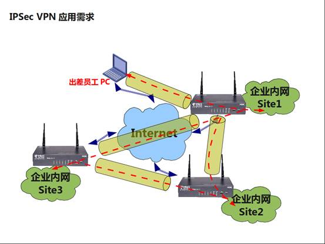
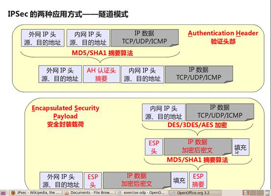
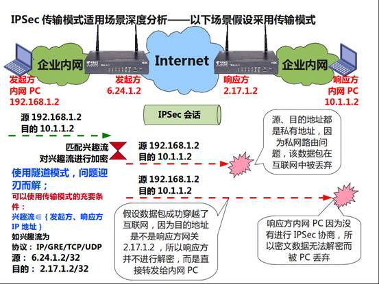
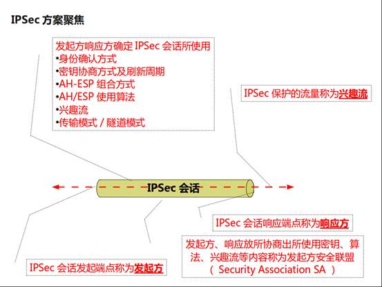
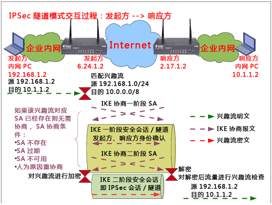
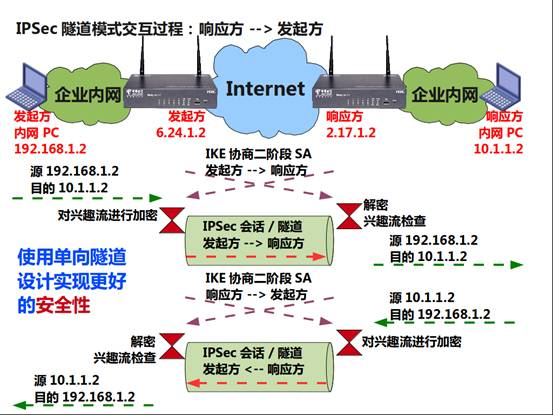

# IPSec VPN

IPSec VPN是目前VPN技术中点击率非常高的一种技术，同时提供VPN和信息加密两项技术。

## IPSec VPN应用场景

IPSec VPN的应用场景分为3种：

1. `Site-to-Site`（站点到站点或者网关到网关）：如弯曲评论的3个机构分布在互联网的3个不同的地方，各使用一个商务领航网关相互建立VPN隧道，企业内网（若干PC）之间的数据通过这些网关建立的IPSec隧道实现安全互联。
2. `End-to-End`（端到端或者PC到PC）： 两个PC之间的通信由两个PC之间的IPSec会话保护，而不是网关。
3. `End-to-Site`（端到站点或者PC到网关）：两个PC之间的通信由网关和异地PC之间的IPSec进行保护。
4.
VPN只是IPSec的一种应用方式，IPSec其实是`IP Security`的简称，它的目的是为IP提供高安全性特性，VPN则是在实现这种安全特性的方式下产生的解决方案。IPSec是一个框架性架构，具体由两类协议组成：

1. AH协议（`Authentication Header`，使用较少）：可以同时提供数据完整性确认、数据来源确认、防重放等安全特性；AH常用摘要算法（单向Hash函数）MD5和SHA1实现该特性。
2. ESP协议（`Encapsulated Security Payload`，使用较广）：可以同时提供数据完整性确认、数据加密、防重放等安全特性；ESP通常使用DES、3DES、AES等加密算法实现数据加密，使用MD5或SHA1来实现数据完整性。

为何AH使用较少呢？因为AH无法提供数据加密，所有数据在传输时以明文传输，而ESP提供数据加密；其次AH因为提供数据来源确认（源IP地址一旦改变，AH校验失败），所以无法穿越NAT。当然，IPSec在极端的情况下可以同时使用AH和ESP实现最完整的安全特性，但是此种方案极其少见。

## IPSec封装模式

介绍完IPSec VPN的场景和IPSec协议组成，再来看一下IPSec提供的两种封装模式（传输`Transport`模式和隧道`Tunnel`模式）

可以发现传输模式和隧道模式的区别：

1. 传输模式在AH、ESP处理前后IP头部保持不变，主要用于End-to-End的应用场景。
2. 隧道模式则在AH、ESP处理之后再封装了一个外网IP头，主要用于Site-to-Site的应用场景。

从这张图的对比可以看出：

1. 隧道模式可以适用于任何场景
2. 传输模式只能适合PC到PC的场景

隧道模式虽然可以适用于任何场景，但是隧道模式需要多一层IP头（通常为20字节长度）开销，所以在PC到PC的场景，建议还是使用传输模式。

为了使大家有个更直观的了解，我们看看下图，分析一下为何在Site-to-Site场景中只能使用隧道模式：

如上图所示，如果发起方内网PC发往响应方内网PC的流量满足网关的兴趣流匹配条件，发起方使用传输模式进行封装：

1. IPSec会话建立在发起方、响应方两个网关之间。
2. 由于使用传输模式，所以IP头部并不会有任何变化，IP源地址是192.168.1.2，目的地址是10.1.1.2。
3. 这个数据包发到互联网后，其命运注定是杯具的，为什么这么讲，就因为其目的地址是10.1.1.2吗？这并不是根源，根源在于互联网并不会维护企业网络的路由，所以丢弃的可能性很大。
4. 即使数据包没有在互联网中丢弃，并且幸运地抵达了响应方网关，那么我们指望响应方网关进行解密工作吗？凭什么，的确没什么好的凭据，数据包的目的地址是内网PC的10.1.1.2，所以直接转发了事。
5. 最杯具的是响应方内网PC收到数据包了，因为没有参与IPSec会话的协商会议，没有对应的SA，这个数据包无法解密，而被丢弃。

我们利用这个反证法，巧妙地解释了在Site-to-Site情况下不能使用传输模式的原因。并且提出了使用传输模式的充要条件：兴趣流必须完全在发起方、响应方IP地址范围内的流量。比如在图中，发起方IP地址为6.24.1.2，响应方IP地址为2.17.1.2，那么兴趣流可以是源6.24.1.2/32、目的是2.17.1.2/32，协议可以是任意的，倘若数据包的源、目的IP地址稍有不同，对不起，请使用隧道模式。

## IPSec协商

IPSec除了一些协议原理外，我们更关注的是协议中涉及到方案制定的内容：

1. 兴趣流：IPSec是需要消耗资源的保护措施，并非所有流量都需要IPSec进行处理，而需要IPSec进行保护的流量就称为兴趣流，最后协商出来的兴趣流是由发起方和响应方所指定兴趣流的交集，如发起方指定兴趣流为192.168.1.0/24->10.0.0.0/8，而响应方的兴趣流为10.0.0.0/8->192.168.0.0/16，那么其交集是192.168.1.0/24<-->10.0.0.0/8，这就是最后会被IPSec所保护的兴趣流。
2. 发起方：Initiator，IPSec会话协商的触发方，IPSec会话通常是由指定兴趣流触发协商，触发的过程通常是将数据包中的源、目的地址、协议以及源、目的端口号与提前指定的IPSec兴趣流匹配模板如ACL进行匹配，如果匹配成功则属于指定兴趣流。指定兴趣流只是用于触发协商，至于是否会被IPSec保护要看是否匹配协商兴趣流，但是在通常实施方案过程中，通常会设计成发起方指定兴趣流属于协商兴趣流。
3. 响应方：Responder，IPSec会话协商的接收方，响应方是被动协商，响应方可以指定兴趣流，也可以不指定（完全由发起方指定）。
4. 发起方和响应方协商的内容主要包括：双方身份的确认和密钥种子刷新周期、AH/ESP的组合方式及各自使用的算法，还包括兴趣流、封装模式等。
5. SA：发起方、响应方协商的结果就是曝光率很高的SA，SA通常是包括密钥及密钥生存期、算法、封装模式、发起方、响应方地址、兴趣流等内容。

我们以最常见的IPSec隧道模式为例，解释一下**IPSec的协商过程**：

上图描述了由兴趣流触发的IPSec协商流程，原生IPSec并无身份确认等协商过程，在方案上存在诸多缺陷，如无法支持发起方地址动态变化情况下的身份确认、密钥动态更新等。伴随IPSec出现的IKE（Internet Key Exchange）协议专门用来弥补这些不足：

1. 发起方定义的兴趣流是源192.168.1.0/24目的10.0.0.0/8，所以在接口发送发起方内网PC发给响应方内网PC的数据包，能够得以匹配。
2. 满足兴趣流条件，在转发接口上检查SA不存在、过期或不可用，都会进行协商，否则使用当前SA对数据包进行处理。
3. 协商的过程通常分为两个阶段，第一阶段是为第二阶段服务，第二阶段是真正的为兴趣流服务的SA，两个阶段协商的侧重有所不同，第一阶段主要确认双方身份的正确性，第二阶段则是为兴趣流创建一个指定的安全套件，其最显著的结果就是第二阶段中的兴趣流在会话中是密文。

IPSec中安全性还体现在**第二阶段SA永远是单向的**：

从上图可以发现，在协商第二阶段SA时，SA是分方向性的，发起方到响应方所用SA和响应放到发起方SA是单独协商的，这样做的好处在于即使某个方向的SA被破解并不会波及到另一个方向的SA。这种设计类似于双向车道设计。
